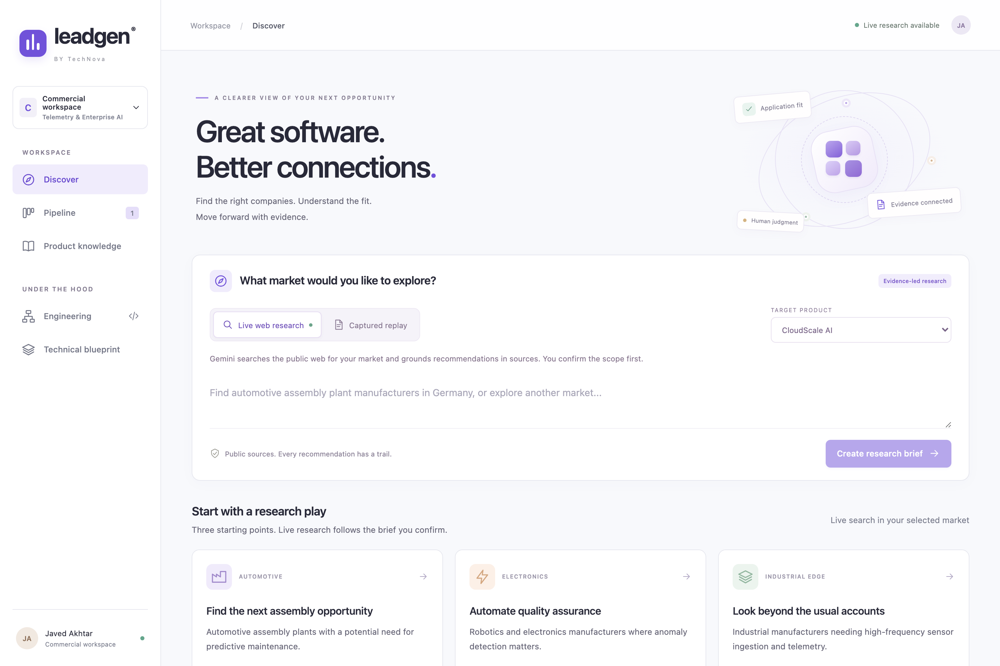
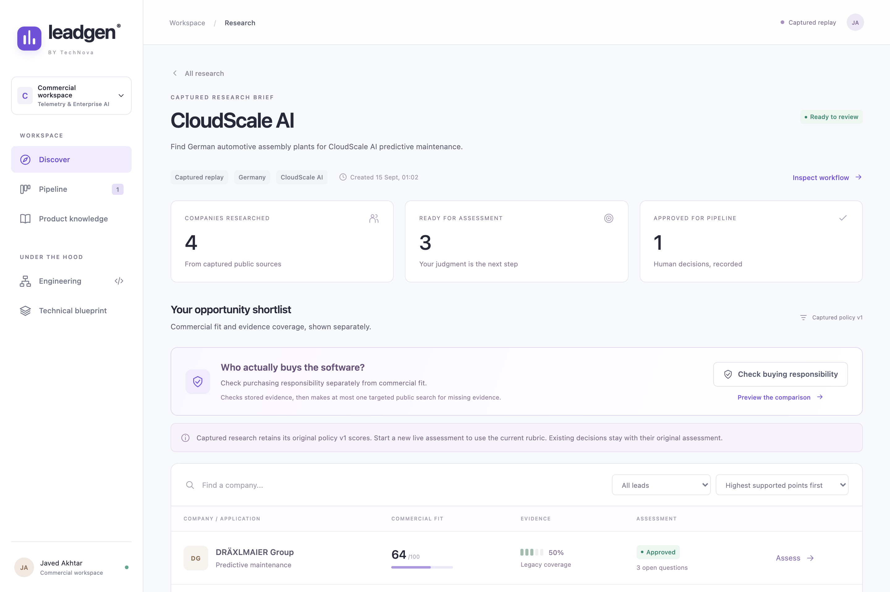
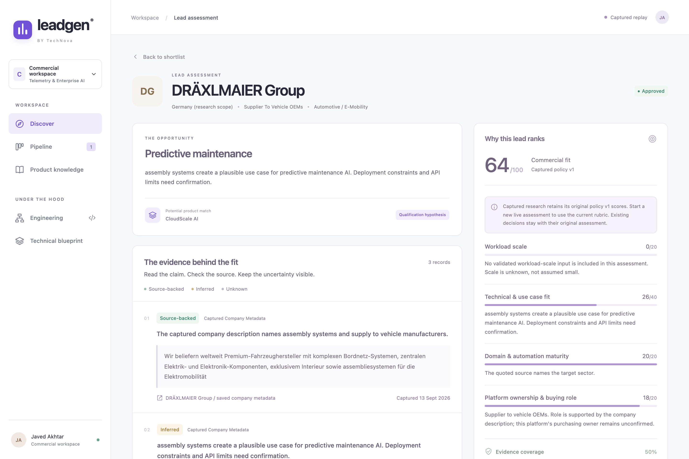
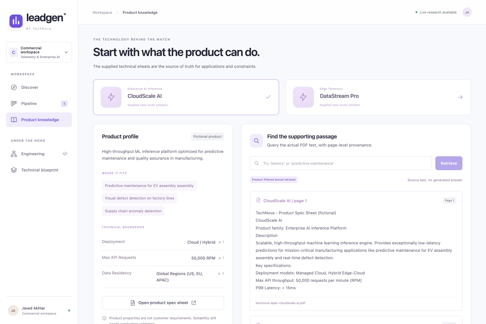
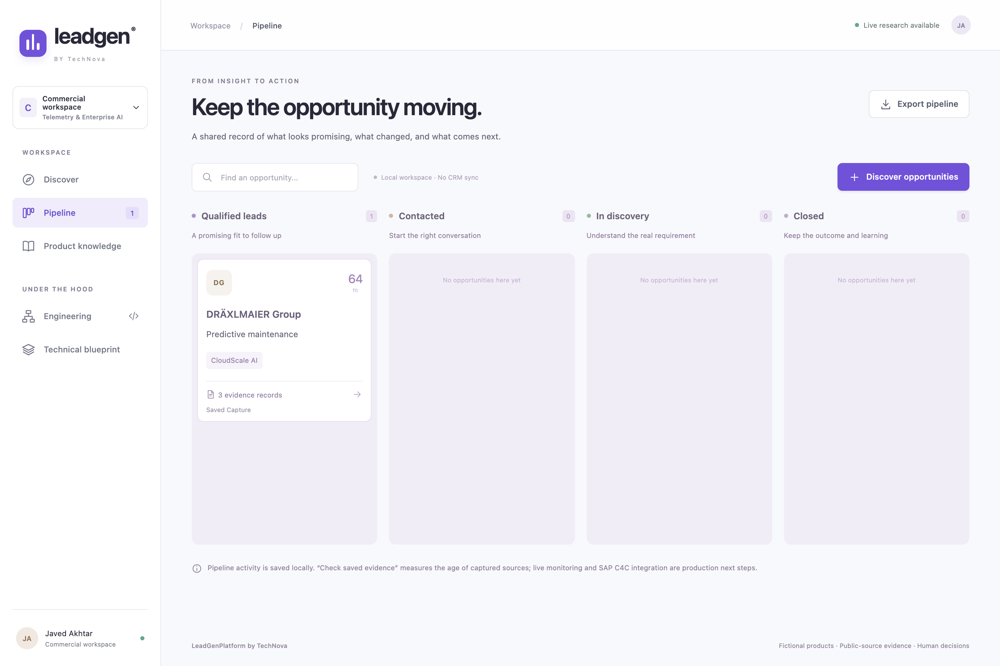

# Open-Source AI Lead Generation Platform

An advanced, evidence-led AI sales intelligence platform designed to discover, evaluate, and qualify enterprise leads against technical product specifications.

This platform automates technical market research using **LangGraph** orchestration, **Gemini with Google Search**, and deterministic qualification engines. It replaces vague AI rankings with verifiable quotes, source citations, hard technical constraint checks, and human decision checkpoints.

---

## 📸 Platform Interface Tour

### 1. Market Discovery & Research Briefs
Enter custom market research prompts or launch curated research plays. Configure target products, regional bounds, account types, and buying-committee roles before execution.


### 2. Opportunity Shortlist & Fit Scoring
Review prioritized enterprise prospects. Leads are ranked across four software dimensions with transparent evidence coverage metrics and technical gating status.


### 3. Lead Assessment & Grounded Evidence Audit
Click any lead to inspect verbatim source quotations, live URLs, extraction timestamps, open qualification questions, and deterministic technical gates.


### 4. Technical Product Knowledge & BM25 Retrieval
Explore product capabilities, throughput bounds, latency thresholds, and deployment topology, complete with page citations retrieved from technical datasheets.


### 5. LangGraph Engineering & Workflow Inspection
Gain full visibility into the underlying state machines. Inspect checkpoints, node transitions, token usage, and evaluation assertions in real time.


### 6. Buyer Qualification & Purchasing Authority
Distinguish technical platform users and architects from genuine budget holders and commercial software license purchasers.


### 7. Sales Pipeline & Kanban Workspace
Track approved leads across pipeline stages (Qualified, Contacted, In Discovery, Closed) with complete audit history and CSV/JSON export.


---

## 🚀 Core Features

- **Evidence-Led Research**: Every claim is backed by extracted quotes and traceable public URLs—no hallucinated company metrics.
- **Enterprise Software Scoring Engine**: Evaluates four balanced dimensions (100 pts total):
  1. **Workload Scale (20 pts)**: Quantified telemetry, sensor counts, or production-line throughput—not headcount.
  2. **Technical & Stack Fit (40 pts)**: Operational use case plus deployment topology or named incumbent (PI, AWS IoT, MQTT).
  3. **In-market Intent (20 pts)**: Job posts, RFPs/tenders, digital-factory programs, or trade-show signals. Industry membership is not intent.
  4. **Buying Committee & Commercial Motion (20 pts)**: Named OT/IT/ops roles, and whether they license the platform, buy a turnkey SI package, or inherit a customer-mandated stack.
- **ICP then intent**: Live search hunts operating plants *and* jobs, RFPs, incumbents, and named buyers. Fit is not treated as buying now.
- **Software commercial motions**: Platform user, specifier, license purchaser, turnkey-SI buyer, and customer-mandated stack are qualified separately from the fit score.
- **Deterministic Technical Gates**: Hard constraint enforcement (e.g. latency guarantees, on-premises isolation) that models cannot bypass.
- **Stateful Human-in-the-Loop Orchestration**: Built with LangGraph. Research pauses for human review and scope confirmation.
- **Zero-Trust Knowledge Boundary**: Public web extracts are treated as untrusted hypotheses; internal technical datasheets form the verified ground truth.

---

## 🛠️ Quick Start

### 1. Prerequisites
- Python 3.10+
- Node.js 18+
- Google Gemini API Key

### 2. Backend Setup
```bash
python3 -m venv .venv
source .venv/bin/activate
pip install -r requirements.txt

cp .env.example .env
# Add your GEMINI_API_KEY to .env
```

### 3. Frontend Setup
```bash
cd frontend
npm install
npm run build
cd ..
```

### 4. Run the Application
From the repository root:
```bash
./start.sh
```
Open your browser at **`http://localhost:8040`** to start discovering leads.

---

## 🧪 Testing

Run the automated test suite covering deterministic scoring, graph checkpoints, and API contracts:
```bash
pytest
```

---

## 🏗️ Architecture

```
├── backend/
│   ├── app.py           # FastAPI REST endpoints & static frontend serving
│   ├── assessment.py    # Deterministic 100-point software scoring & gates
│   ├── buyers.py        # Purchasing authority qualification engine
│   ├── domain.py        # Lead data models & criteria definitions
│   ├── evaluations.py   # Automated rubric contract checks
│   ├── live.py          # Gemini live web search & extraction graph
│   ├── store.py         # SQLite persistence & checkpoints
│   └── workflows.py     # LangGraph state machine definitions
├── frontend/
│   ├── src/             # React 18 UI components & design system
│   ├── dist/            # Compiled static distribution
│   └── screenshots/     # Interface captures & assets
├── docs/
│   └── images/          # High-resolution platform documentation screenshots
└── scripts/
    └── capture_ui_screenshots.mjs # Headless CDP screenshot generator
```

---

## 📄 License

MIT License. Built with ❤️ for technical sales and revenue engineering teams.
