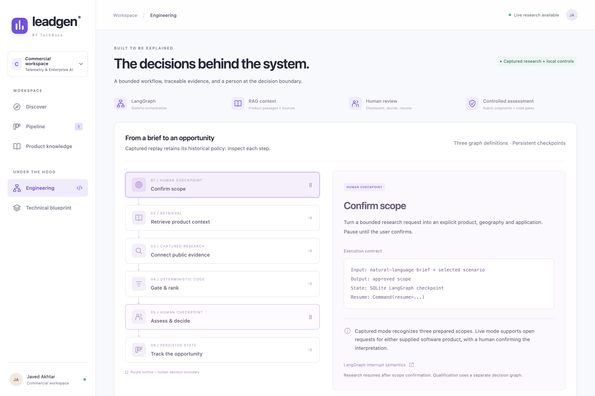
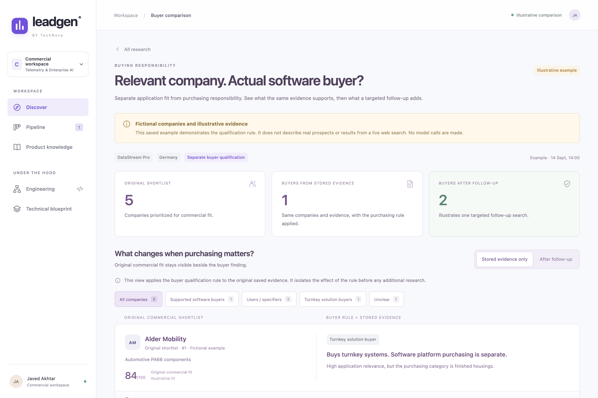

# LeadGen Frontend

This directory contains the user interface for the AI Lead Generation Platform. Built with React and Vite, it delivers a high-performance, real-time workspace for technical sales teams, featuring evidence-backed qualification, human-in-the-loop review, and interactive graph traceability.

## Visual Interface Overview

### 1. Market Discovery & Research Plays
Start an evidence-led research run with live Gemini web search or captured market replays.


### 2. Opportunity Shortlist & Fit Scoring
View prioritized leads with quantitative 100-point commercial fit scores and evidence coverage indicators.


### 3. Transparent Lead Assessment & Audit Trail
Inspect exact quotes, source links, confidence ratings, open qualification gaps, and software technical gate checks.


### 4. Technical Product Knowledge & BM25 Retrieval
Explore product specifications with verified page-level citations from technical datasheets.


### 5. LangGraph Engineering & Workflow Visualizer
Interactive step-by-step state inspection of graph checkpoints, human review gates, and deterministic scoring logic.


### 6. Purchasing Authority & Buyer Qualification
Separate technical suitability from commercial purchasing responsibility.


### 7. Sales Pipeline & Kanban Workspace
Track approved opportunities across qualification stages with full decision logs and export capabilities.


---

## Development

```bash
# Install dependencies
npm install

# Start development server with HMR
npm run dev

# Build production bundle (output to dist/)
npm run build
```

When running full-stack, the FastAPI backend serves the production bundle built in `dist/` directly from `http://localhost:8040`.
